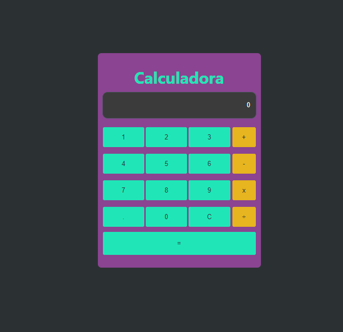

# Calculadora
El plan del proyecto es replicar las acciones básicas de una calculadora a través del lenguaje de **TypeScript**.

Algunas de las acciones realizadas por esta calculadora son:
* Suma
* Resta
* Multiplicación
* División

Link de versión actual (http://s-calalpa.com)

